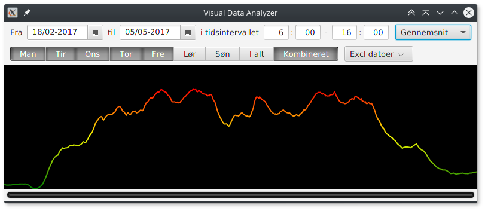

# DataVisualizer
This application will be able to display rather large datasets in a convenient graphical approach, combined with some statistical analysis.

It is designed to make it easy to analyse large continual datasets from a range of sensor inputs, where the value is a function of time. Furthermore, it will make it easy to compare different days, weeks, months or any arbitrary time intervals.

The application is written entirely in JavaFX 8, and is from the very beginning developed upon a principle of multitasking, where background threads are managed through a FixedThreadPoolExecutor singleton.

Do however note, that this is an application in development - and it is yet in its early development stage, where the different components are being developed and tested, but is only beginning to be combined into something actually useful...

Below is a screenshot of the application in its current version, where it displays the average time-based concentration of carbondioxide, CO2, in PPM, that is present in the air in a class room at Nymarkskolen, Svendborg, Denmark, throughout a schoolday. The time-based values are the average of every shoolday during the specified period of approximately 2.5 months. The data in the screenshot can therefore be thought of as an average schoolday in the perspective of carbondioxide concentration, and the colourcoded graph visualizes that the concentration is greater than ideal troughout most of the day...

